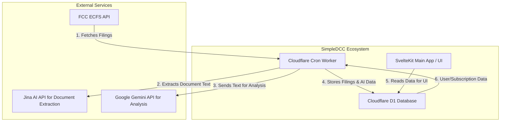
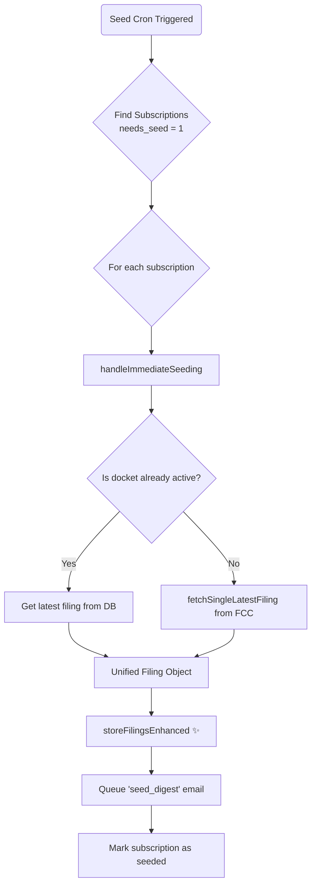
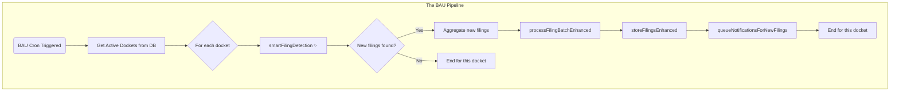

# SimpleDCC Cron Worker Architecture

**Version**: 1.1  
**Last Updated**: July 16, 2025  
**Author**: Gemini AI Assistant  
**Status**: Live Production System  

---

## 1. Executive Summary

The SimpleDCC Cron Worker is a sophisticated, serverless Cloudflare Worker responsible for the automated monitoring of FCC dockets, AI-powered analysis of new filings, and queuing of user notifications. It operates on a dual-cron strategy to ensure both timely processing of new filings and immediate onboarding for new user subscriptions.

The architecture is designed for resilience and efficiency, featuring:
-   **Smart Filing Detection** to minimize redundant API calls to the FCC.
-   **A Multi-Stage Processing Pipeline** that handles data ingestion, document extraction, AI analysis, and storage.
-   **A Dual-Cron System** to separate routine monitoring from new subscription seeding.
-   **Resilience Features** like a circuit breaker for the AI service and graceful degradation of service.
-   **Unified Processing Logic** ensuring all filings, regardless of source (BAU cron vs. seed cron), receive the same AI enhancement.

This document provides a technical foundation for understanding the current system and planning future enhancements.

---

## 2. High-Level Architecture

The cron worker is a central component that interacts with several external services and the primary user-facing application via a shared Cloudflare D1 database.

---

## 3. Cron Job Orchestration (`/src/index.ts`)

The system uses a time-based trigger in `wrangler.toml` to run the worker. The logic within `index.ts` then determines which specific job to execute based on the minute of the hour.

### Dual-Cron Strategy

-   **Seed Cron (`runSeedCron`)**
    -   **Trigger**: Runs at **:45** past the hour.
    -   **Purpose**: Exclusively handles seeding for new user subscriptions. This ensures new users get an immediate "welcome" filing without waiting for the main processing job.
    -   **Priority**: High-priority, focused task to improve user onboarding experience.

-   **BAU (Business-As-Usual) Cron (`runDataPipeline`)**
    -   **Trigger**: Runs at **:00** past the hour (the top of the hour).
    -   **Purpose**: The main data processing pipeline. It checks all actively monitored dockets for new filings and processes them.
    -   **Fallback**: It also includes a fallback mechanism to process any seeding jobs that may have failed during the dedicated Seed Cron run.

### Processing Cadence & Timezones
- The worker uses ET (Eastern Time) to determine its processing strategy.
- **Business Hours (8 AM - 6 PM ET)**: Full processing.
- **Evening Hours (6 PM - 10 PM ET)**: Reduced processing.
- **Quiet Hours (10 PM - 8 AM ET)**: Minimal processing to conserve resources.
- **Deluge Flag Reset**: A "deluge mode" flag, which pauses processing for dockets with unusually high activity, is automatically reset once daily at 8 AM ET.

---

## 4. The Seeding Pipeline (New Subscriptions)

This pipeline is triggered by the **Seed Cron** at :45. Its goal is to provide the latest filing to a user who has just subscribed to a new docket.

**Key Module**: `/src/lib/seeding/seed-operations.js`

**Critical Function: `handleImmediateSeeding`**
-   **If Docket is Already Monitored:** It efficiently grabs the most recent filing directly from the D1 database.
-   **If Docket is New:** It makes a single, direct API call to the FCC (`fetchSingleLatestFiling`) to get only the very latest filing. This avoids the "smart detection" logic, which is unnecessary for a new docket.
-   **The Fix in Action ✨**: It then passes this filing to **`storeFilingsEnhanced`**. This is the crucial step that ensures the seed filing goes through the full document extraction and AI analysis pipeline, unifying the system's logic.

---

## 5. The BAU Pipeline (Regular Monitoring)

This is the main data processing engine, triggered by the **BAU Cron** at the top of the hour.

**Orchestrator**: `runDataPipeline` in `/src/index.ts`

### Key Stages & Modules:

**A. Smart Filing Detection ✨**
-   **Module**: `/src/lib/fcc/ecfs-enhanced-client.js`
-   **Function**: `smartFilingDetection`
-   **Process**:
    1.  **Quick ID Check**: Fetches *only the ID* of the latest filing from the FCC for a given docket (a very small, fast API call).
    2.  **Compare**: Compares this ID to the `latest_filing_id` stored in the `active_dockets` table in our database.
    3.  **Targeted Fetch**: Only if the IDs differ does it proceed to fetch a small batch of recent filings to identify the new ones.
-   **Benefit**: This dramatically reduces API calls to the FCC, saving resources and avoiding rate limits. It is a cornerstone of the system's efficiency.
-   **Deluge Mode**: If this process finds an unusually high number of new filings (e.g., >7), it flags the docket for "deluge mode," temporarily pausing processing for it and notifying users.

**B. AI Processing**
-   **Module**: `/src/lib/ai/gemini-enhanced.js`
-   **Function**: `processFilingBatchEnhanced`
-   **Process**:
    1.  Receives a batch of new filings.
    2.  For each filing, it iterates through its documents.
    3.  It calls the Jina AI API via `/src/lib/documents/jina-processor.js` to extract the full text from the document's PDF/HTML source.
    4.  It constructs a detailed prompt containing both the filing's metadata and the extracted document text.
    5.  It sends this prompt to the Google Gemini API for analysis.
-   **Resilience**: This module contains a **circuit breaker**. If the Gemini API returns errors repeatedly, the circuit opens, and the system temporarily stops sending requests for a few minutes. This prevents cascading failures and gives the API time to recover.

**C. Enhanced Storage & Notification**
-   **Module**: `/src/lib/storage/filing-storage-enhanced.js`
-   **Function**: `storeFilingsEnhanced`
-   **Process**:
    1.  Takes the filings (now enriched with AI data).
    2.  Uses the `storeFilings` function from the original `/lib/storage/filing-storage.js` to perform the final database insertion/update.
    3.  After successful storage, it calls `/src/lib/storage/notification-integration.js` to queue the appropriate user notifications based on user preferences (daily digest, etc.).

---

## 6. Areas for Future Enhancement

Based on this architecture, several areas could be targeted for future development:

-   **Parallel Processing**: The current BAU pipeline processes dockets sequentially. Introducing parallel processing for dockets could significantly speed up the cron job.
-   **Content Caching**: The text extracted from documents could be cached (e.g., in Cloudflare R2) to avoid re-processing the same document if it appears in a different context, reducing Jina API costs.
-   **Advanced AI Features**: The structured AI output provides a foundation for more advanced features, like trend analysis across filings, sentiment analysis, or named-entity recognition to automatically tag companies and individuals.
-   **Dynamic Rate Limiting**: The delays between API calls are currently static. A more dynamic system could adjust delays based on API response headers or recent error rates.
-   **Refining Deluge Mode**: The deluge mode logic could be enhanced to allow for partial processing or to automatically adjust its threshold based on historical docket activity. 