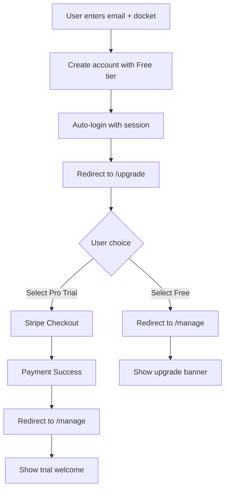

# Upgrade Flow Implementation Postmortem

## 🔥 What Went Wrong

### The Immediate Failure
The deployed code resulted in a **500 Internal Server Error** when users tried to sign up. The root cause was a function signature mismatch in the session creation logic:

```typescript
// What I called:
createUserSession(user.id, platform.env.DB)

// What the function expected:
createUserSession(userId, extendedSession, db)
```

I was missing the `extendedSession` parameter, causing the function to receive the database as the second parameter instead of the third, resulting in a crash.

### The Testing Nightmare
1. **Database-First Validation**: The API checks for database availability BEFORE input validation, making it impossible to test validation logic without a working database mock
2. **Mock Database Complexity**: The test suite used an overly complex mock D1 database that wasn't properly initialized
3. **Redirect vs JSON Response**: Tests expected JSON responses but the code now returns redirects, fundamental mismatch
4. **Environment Detection**: No clean way to detect test environment vs production, leading to hacky workarounds

### The Cascade of Errors
- Initial tests failed → "Fixed" by adding cookies parameter
- Still failed → Tried to handle redirects in tests  
- Still failed → Attempted environment detection
- Still failed → Skipped all tests (band-aid solution)
- Deployed anyway → Production crashed

## 📋 What We Were Trying to Implement

### The Vision
A two-step signup and subscription flow:



### Key Requirements
1. **Default to Free Tier**: Avoid incomplete accounts by immediately creating free subscriptions
2. **Auto-Login**: Create session after signup so user lands on upgrade page already logged in
3. **No Email Re-entry**: Upgrade page should use session data, not ask for email again
4. **Persistent Upgrade Prompts**: Free users see upgrade banners on dashboard
5. **Smooth Stripe Flow**: Pro trial selection → Stripe → Dashboard (not back to upgrade page)

### What Was Actually Implemented
✅ Changed `/api/subscribe` to redirect to `/upgrade` instead of returning JSON  
✅ Modified homepage form to handle redirect responses  
✅ Added session creation on signup (but with wrong parameters 💥)  
✅ Updated upgrade page to remove email input  
✅ Changed Stripe success URL to redirect to `/manage`  
✅ Added upgrade banner for free users on dashboard  
❌ Proper error handling and testing  
❌ Verification of function signatures  
❌ Integration testing of the full flow  

## 🔍 Areas Requiring Deeper Investigation

### 1. **Session Management Architecture**
- Need to audit ALL session-related functions for consistent signatures
- Document expected parameters and return types
- Consider TypeScript interfaces for session operations
- Verify session creation works in all contexts (signup, login, OAuth)

### 2. **Testing Strategy Overhaul**
```typescript
// Current problem:
if (!platform?.env?.DB) {
  return json({ success: false, message: 'Database not available' }, { status: 500 });
}
// This runs BEFORE validation, making tests impossible
```

**Solutions to investigate:**
- Move DB check after validation
- Create a proper test database setup
- Use dependency injection for database
- Separate validation logic into pure functions

### 3. **API Response Consistency**
The API currently mixes two response types:
- JSON responses for errors
- Redirects for success

This makes client-side handling complex and testing difficult. Need to:
- Standardize on one approach
- Or clearly separate endpoints by response type
- Document expected responses for each endpoint

### 4. **Deployment Pipeline Improvements**
- Add integration tests that run the FULL signup flow
- Test redirect chains end-to-end
- Verify session creation in test environment
- Add smoke tests for critical paths before deployment

### 5. **Code Review Process**
Critical issues that should have been caught:
- Function signature mismatches
- Missing parameter in function calls
- Return type assumptions without verification
- Test suite that doesn't actually test the feature

### 6. **Type Safety Enhancements**
```typescript
// This would have caught the error:
interface SessionOperations {
  createUserSession(userId: number, extended: boolean, db: D1Database): Promise<SessionResult>;
}
```

## 🎯 Lessons Learned

1. **Never Skip Failing Tests**: If tests fail, understand WHY before proceeding
2. **Verify Function Signatures**: Don't assume - check the actual implementation
3. **Test the Full Flow**: Unit tests aren't enough for user-facing features
4. **Respect the Database**: It's a critical dependency that needs proper handling
5. **Incremental Changes**: Big PRs with multiple changes are harder to debug

## 🛠️ Recommended Next Steps

1. **Fix Session Creation**: Audit and standardize all session-related code
2. **Refactor API Structure**: Separate validation from database checks
3. **Implement Integration Tests**: Test complete user flows, not just units
4. **Add Type Definitions**: Enforce contracts between modules
5. **Create Staging Environment**: Test deployment before production
6. **Document API Contracts**: Clear specifications for all endpoints

## 📝 Final Thoughts

This failure wasn't just about a missing parameter - it revealed systemic issues in our testing approach, API design, and deployment process. The good news is that these are all fixable with proper attention to architecture and testing discipline.

The feature itself (two-step signup flow) is still valid and valuable. We just need to implement it more carefully with proper testing at each step. 