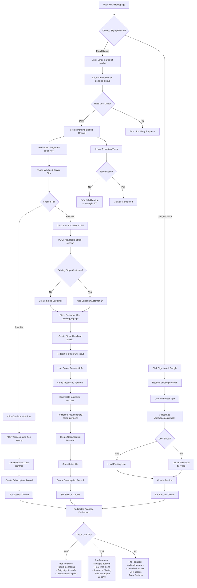

# SimpleDCC User Signup Flow by Tier

## Overview

SimpleDCC offers three user tiers with different signup paths:
- **Free Tier**: Basic monitoring with limited features
- **Pro Trial**: 30-day trial with full pro features
- **Pro (Paid)**: Full access after trial or direct purchase

Users can sign up via email or Google OAuth, with the email path offering a choice between free and pro tiers.

## Visual Flow Diagram



## Tier Details

### Free Tier
- **Price**: $0/month
- **Features**:
  - Monitor 1 FCC docket
  - Daily email digest (1 PM ET)
  - Basic filing notifications
  - Standard email support
- **Limitations**:
  - No real-time alerts
  - No advanced filtering
  - No API access
  - Limited to daily frequency

### Pro Trial Tier
- **Duration**: 30 days
- **Price**: $0 during trial, then $19/month
- **Features**: All Pro features (see below)
- **Payment**: Credit card required, charged after trial
- **Cancellation**: Can cancel anytime during trial

### Pro Tier
- **Price**: $19/month
- **Features**:
  - Monitor unlimited FCC dockets
  - Real-time email alerts
  - Daily and weekly digest options
  - Advanced filtering and search
  - Priority email support
  - API access (coming soon)
  - Team features (coming soon)
- **Billing**: Monthly subscription via Stripe

## Signup Paths by Method

### Path 1: Email Signup → Free Tier

1. **User Action**: Fills out homepage form with email and docket number
2. **System Process**:
   - Validates email format and docket format (XX-XXX)
   - Checks rate limit (3 attempts per 5 minutes per email)
   - Creates pending signup record with 1-hour expiration
3. **Redirect**: User sent to `/upgrade?token={unique_id}`
4. **Tier Selection**: User clicks "Continue with Free"
5. **Account Creation**:
   - Creates user record with `tier='free'`
   - Creates subscription for specified docket
   - Sets session cookie
6. **Result**: User lands on dashboard with free features

### Path 2: Email Signup → Pro Trial

1. **Steps 1-3**: Same as free tier path
2. **Tier Selection**: User clicks "Start 30-Day Pro Trial"
3. **Stripe Integration**:
   - Creates or retrieves Stripe customer
   - Generates checkout session with 30-day trial
   - Includes metadata for tracking
4. **Payment Collection**:
   - User enters credit card on Stripe's secure checkout
   - No immediate charge (trial period)
   - Stripe handles PCI compliance
5. **Success Callback**:
   - Stripe redirects to success URL with token
   - System creates user with `tier='trial'`
   - Stores Stripe customer and subscription IDs
   - Sets `trial_expires_at` timestamp
6. **Result**: User lands on dashboard with pro features

### Path 3: Google OAuth → Free Tier

1. **User Action**: Clicks "Sign in with Google"
2. **OAuth Flow**:
   - Redirects to Google authorization
   - User approves permissions (email, profile)
   - Google redirects back with authorization code
3. **Account Handling**:
   - System checks if user exists by Google ID
   - Creates new user if needed with `tier='free'`
   - Creates session immediately
4. **Result**: User lands on dashboard (must add dockets manually)

## Technical Implementation

### Pending Signup System

```javascript
// Pending signup record structure
{
  id: "uuid-v4",                    // Unique token
  email: "user@example.com",        // User email
  docket_number: "23-456",          // Initial docket
  stripe_customer_id: null,         // Set if Stripe flow
  stripe_subscription_id: null,     // Set after payment
  completed: false,                 // Marked true when used
  expires_at: "2024-01-01T12:00:00Z", // 1 hour from creation
  created_at: "2024-01-01T11:00:00Z"
}
```

### Rate Limiting

- **Scope**: Per email address
- **Limit**: 3 requests per 5-minute window
- **Storage**: In-memory cache (could be Redis in production)
- **Response**: 429 Too Many Requests with retry-after header

### Session Management

```javascript
// Session cookie configuration
{
  name: 'user_session',
  value: sessionToken,
  path: '/',
  httpOnly: true,
  secure: true,
  sameSite: 'lax',
  maxAge: 86400 // 24 hours (30 days if "remember me")
}
```

### Stripe Configuration

```javascript
// Checkout session for pro trial
{
  customer: customerId,
  mode: 'subscription',
  line_items: [{
    price: STRIPE_PRO_PRICE_ID,
    quantity: 1
  }],
  subscription_data: {
    trial_period_days: 30,
    metadata: {
      docket_number: pendingSignup.docket_number,
      pending_signup_id: token
    }
  },
  success_url: `${origin}/api/stripe-success?token=${token}`,
  cancel_url: `${origin}/upgrade?token=${token}`,
  customer_update: {
    address: 'auto',
    name: 'auto'
  }
}
```

## User Experience by Tier

### Free Tier Experience

1. **Immediate Access**: No payment required
2. **Single Docket**: Can monitor one FCC docket
3. **Daily Emails**: Receive digest at 1 PM ET
4. **Upgrade Path**: Can upgrade to pro anytime
5. **Data Retention**: Full history preserved

### Trial Tier Experience

1. **Full Features**: All pro features for 30 days
2. **Payment Reminder**: Email sent 3 days before trial ends
3. **Automatic Conversion**: Becomes paid pro after trial
4. **Cancellation**: Can cancel anytime, keeps access until trial ends
5. **Downgrade**: Reverts to free tier if cancelled

### Pro Tier Experience

1. **Unlimited Dockets**: Add as many as needed
2. **Real-time Alerts**: Immediate notifications
3. **Flexible Frequency**: Daily or weekly digests
4. **Priority Support**: Faster response times
5. **Future Features**: First access to new capabilities

## Security Measures

### Token Security
- UUID v4 tokens (cryptographically secure)
- 1-hour expiration for pending signups
- Single-use tokens (marked completed after use)
- Constant-time comparison for token validation

### Payment Security
- All payment data handled by Stripe
- No credit card info stored in our database
- Webhook signature verification
- HTTPS required for all endpoints

### Session Security
- HTTP-only cookies (no JavaScript access)
- Secure flag (HTTPS only)
- SameSite protection (CSRF prevention)
- Regular session rotation

## Error Handling

### Common Error Scenarios

1. **Expired Token**
   - Message: "This signup link has expired. Please start over."
   - User must return to homepage

2. **Already Used Token**
   - Message: "This signup has already been completed."
   - Redirect to login page

3. **Invalid Docket Format**
   - Message: "Please enter a valid docket number (e.g., 23-456)"
   - Form validation prevents submission

4. **Stripe Checkout Cancelled**
   - User returned to upgrade page
   - Can retry or choose free tier

5. **Rate Limit Exceeded**
   - Message: "Too many attempts. Please try again in 5 minutes."
   - Prevents spam and abuse

## Upgrade/Downgrade Flows

### Free to Pro Upgrade
1. User visits `/manage` dashboard
2. Clicks "Upgrade to Pro"
3. Enters Stripe checkout flow
4. Immediate access to pro features
5. First charge after 30-day trial

### Pro to Free Downgrade
1. User cancels subscription
2. Keeps pro access until period ends
3. Automatically reverts to free tier
4. Keeps first docket, others deactivated
5. Can reactivate anytime

### Trial Cancellation
1. User cancels during trial
2. No charges incurred
3. Keeps pro access for trial duration
4. Reverts to free after trial ends
5. Payment method removed

## Database Schema

### Users Table
```sql
CREATE TABLE users (
  id INTEGER PRIMARY KEY AUTOINCREMENT,
  email TEXT UNIQUE NOT NULL,
  google_id TEXT UNIQUE,
  session_token TEXT,
  tier TEXT DEFAULT 'free' CHECK(tier IN ('free', 'trial', 'pro')),
  stripe_customer_id TEXT,
  stripe_subscription_id TEXT,
  trial_expires_at TIMESTAMP,
  created_at TIMESTAMP DEFAULT CURRENT_TIMESTAMP,
  updated_at TIMESTAMP DEFAULT CURRENT_TIMESTAMP
);
```

### Pending Signups Table
```sql
CREATE TABLE pending_signups (
  id TEXT PRIMARY KEY,
  email TEXT NOT NULL,
  docket_number TEXT NOT NULL,
  stripe_customer_id TEXT,
  stripe_subscription_id TEXT,
  completed BOOLEAN DEFAULT FALSE,
  expires_at TIMESTAMP NOT NULL,
  created_at TIMESTAMP DEFAULT CURRENT_TIMESTAMP
);
```

### Subscriptions Table
```sql
CREATE TABLE subscriptions (
  id INTEGER PRIMARY KEY AUTOINCREMENT,
  user_id INTEGER NOT NULL,
  docket_number TEXT NOT NULL,
  frequency TEXT DEFAULT 'daily' CHECK(frequency IN ('daily', 'weekly')),
  active BOOLEAN DEFAULT TRUE,
  created_at TIMESTAMP DEFAULT CURRENT_TIMESTAMP,
  FOREIGN KEY (user_id) REFERENCES users(id),
  UNIQUE(user_id, docket_number)
);
```

## Monitoring & Analytics

### Key Metrics

1. **Conversion Funnel**
   - Homepage visits → Signup starts
   - Signup starts → Pending signups
   - Pending signups → Completed signups
   - Free signups → Pro trials
   - Pro trials → Paid conversions

2. **Tier Distribution**
   - Active free users
   - Active trial users
   - Active pro users
   - Churn rate by tier

3. **Signup Methods**
   - Email vs Google OAuth
   - Success rates by method
   - Time to completion

4. **Error Rates**
   - Token expiration rate
   - Payment failure rate
   - Rate limit triggers

## Future Enhancements

### Planned Features

1. **Social Login Expansion**
   - GitHub authentication
   - Microsoft authentication
   - Apple Sign In

2. **Team Accounts**
   - Multiple users per account
   - Role-based permissions
   - Centralized billing

3. **Enterprise Tier**
   - Custom pricing
   - SLA guarantees
   - Dedicated support
   - API rate limit increases

4. **Referral Program**
   - Referral tracking
   - Discount codes
   - Affiliate partnerships

5. **Annual Billing**
   - 2 months free with annual plan
   - Automatic renewal
   - Pro-rated upgrades

## Support Documentation

### For Users

1. **Getting Started Guide**
   - How to sign up
   - Choosing the right tier
   - Adding your first docket

2. **Billing FAQ**
   - When charges occur
   - How to update payment
   - Cancellation process

3. **Feature Comparison**
   - Detailed tier comparison
   - Use case examples
   - Upgrade benefits

### For Support Team

1. **Common Issues**
   - Password resets
   - Payment failures
   - Account access

2. **Admin Tools**
   - User lookup
   - Subscription management
   - Manual tier changes

3. **Escalation Path**
   - Tier 1: Basic support
   - Tier 2: Technical issues
   - Tier 3: Engineering team 